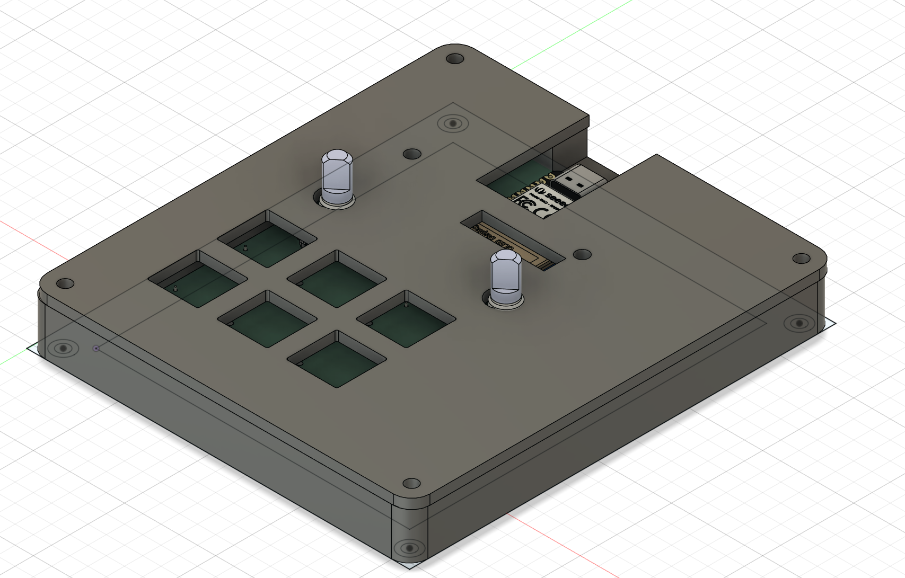
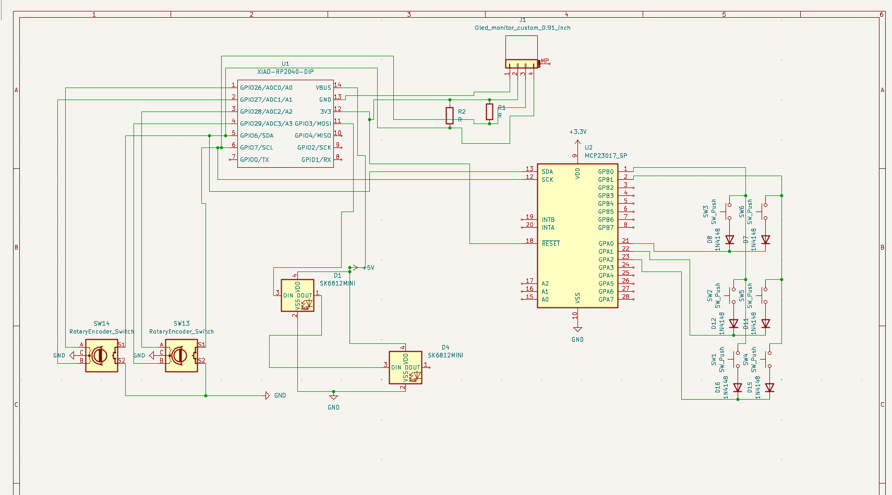
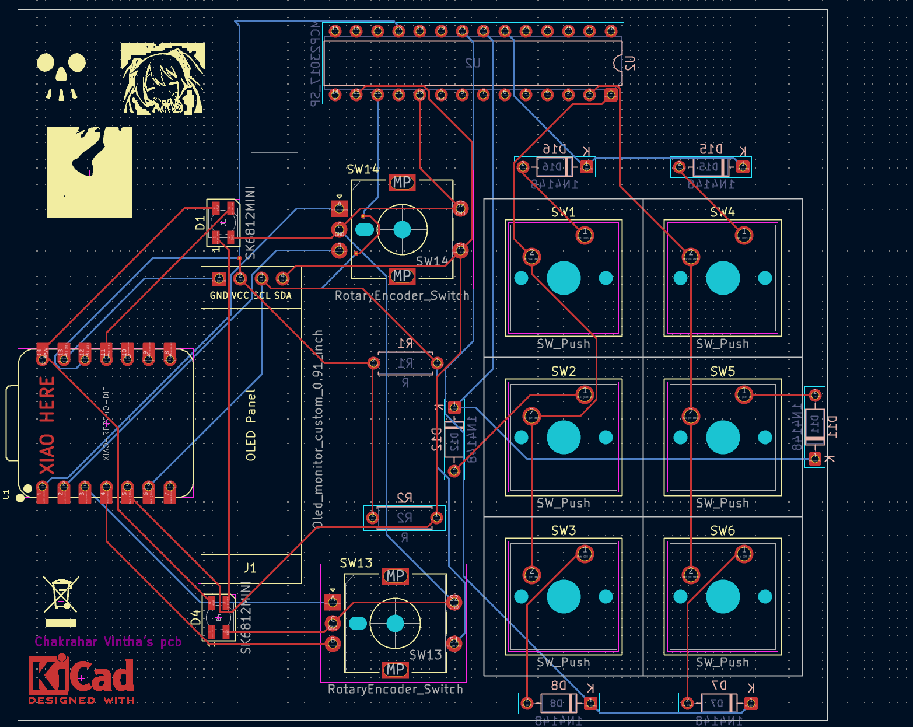
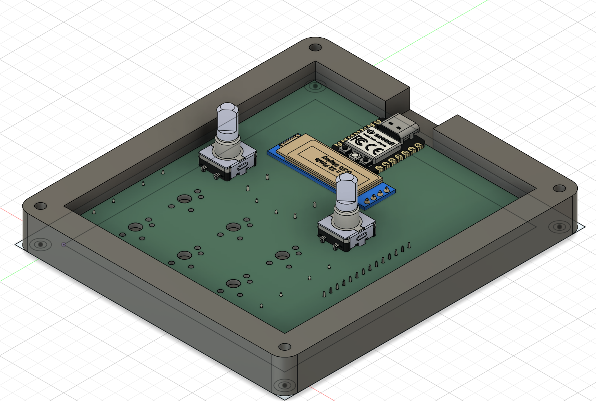

# Chakra's pad Project

## 1. Overall Hackpad

## 2. Schematic

## 3. PCB Layout

## 4. Case and Assembly

## 5. Bill of Materials (BOM)
[Click here to view my BOM](bom.csv)

## How it Works
* **Brain:** XIAO RP2040.
* **Buttons:** 6 keys handled by an MCP23017 I/O Expander.
* **Extras:** Dual rotary encoders and an OLED display.